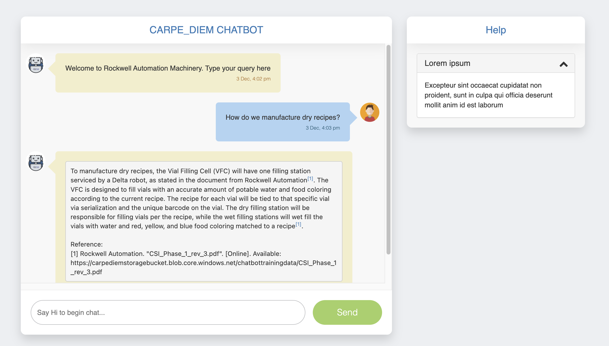

# Chatbot Frontend
A simple chatbot frontend for plugging in my bots.

# How to run
1. Prerequisites: 
    * Visual Studio Code 
    * [Live Server extension](https://marketplace.visualstudio.com/items?itemName=ritwickdey.LiveServer)
2. Clone this project
3. Open this folder in vscode and run bot.html using Live Server extension.

## Screenshot

[Credits to the original author](https://github.com/PandaWhoCodes/chatbot-frontend)

